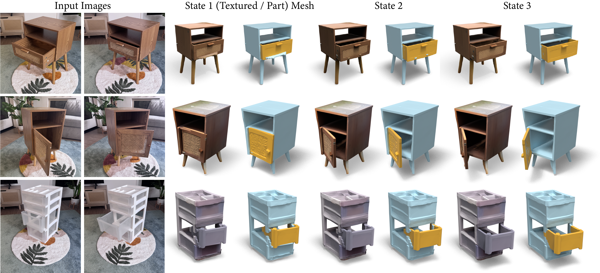

<h1 align="center">FreeArt3D: Training-Free Articulated Object Generation using 3D Diffusion</h1> 
<h3 align="center">SIGGRAPH Asia 2025</h3> 

<p align="center"><a href="https://czzzzh.github.io/FreeArt3D/FreeArt3D.pdf"></a>
<a href="https://czzzzh.github.io/FreeArt3D"></a>
<a href="https://huggingface.co/spaces/MorPhLingXD/FreeArt3D"></a>
</p>


Official Implementation for ***FreeArt3D: Training-Free Articulated Object Generation using 3D Diffusion***

<p align="center"></p>


## 🔔 Updates
[10/29/2025] We released our code, dataset and results!


## 🚧 TODO List 
- [ ] Release test data on Objaverse dataset


## 🚀 Quick Start
1. Setup the environment

   ```bash
   conda create -n fa3d python=3.10
   conda activate fa3d
   bash setup.sh
   ```

   **Note:** If you need to use different torch or cudatoolkit version (for correctly building other libraries), please also install the compatible version of [kaolin](https://github.com/NVIDIAGameWorks/kaolin)

2. Download the checkpoint of [GIM-DKM](https://github.com/xuelunshen/gim) from [Google Drive](https://drive.google.com/file/d/1iYmEctoA-a3sds9VQPwVJIJbs0v6oztb/view?usp=sharing), and put it to `gim/weights`

3. Generate the articulated **cabinet** from the input images in `examples/cabinet`

   ```bash
   python run_two_parts.py
   ```

​	Then check `outputs/cabinet/sds_output/part_meshes` and  `outputs/cabinet/sds_output/states` for the articulated mesh results!

​	You can also check `outputs/cabinet/output.urdf` for the **URDF** format output, and we provide a script to parse it in `pipelines/urdf.py`

4. Try other examples by simply changing the input directory and the joint type.

   ```bash
   python run_two_parts.py --input_dir examples/cabinet2 --joint_type revolute
   python run_two_parts.py --input_dir examples/cabinet3
   ```
   


## 💻 PartNet-Mobility Articulation

1. Download the **preprocessed PartNet-Mobility dataset** from [Google Drive](https://drive.google.com/file/d/1MGvp_Sm7lkn87ZXH3I1uSGNTJ_-hD4eA/view?usp=drive_link) (including **144** objects in **12** categories, the objects have been rendered with disks) and put it to the `datasets` directory. The folder structure should be 

   ```bash
   FreeArt3D
   |--datasets
       |-- PartNet
           |-- 100214 
           └-- ...
   ```

2. Then run the same script with specified input directory and the PartNet option

   ```bash
   python run_two_parts.py --input_dir datasets/PartNet/100214 --partnet # You can use any other object id included in the dataset 
   ```
   
3. *(Optional)* Evaluate the metric of results

   We provide the script to evaluate different metrics for the PartNet-Mobility results. Note that this is a general evaluation script so you can use it to evaluate other objects if you have ground-truth for them (simply changing the **test_id**)

   ```bash
   python evaluate_partnet.py --test_id 100214
   ```

4. *(Optional)* Preprocess the PartNet-Mobility dataset

   If you want to test our method on the objects **not in** our processed dataset, you can use the following scripts the process meshes from the [original PartNet-Mobility dataset](https://sapien.ucsd.edu/downloads). Note that you need to manually filter out the joints you want to use. You can check `configs/partnet_target.json` and  `partnet.json` for the format. Here we provide the steps to **preprocess** and **render** the objects according to the object ids in `partnet.json` 

   ```bash
   python preprocess_partnet_joint.py
   blenderproc run preprocess_partnet_mesh.py
   python render_partnet_mesh.py
   ```
   
   The scripts will generate **.glb** meshes at different qpos in `datasets/PartNet/{$test_id}/gt_mesh` and the renderings **with** **disk** in `datasets/PartNet/{$test_id}`, which is the same as the ones in the downloaded preprocessed dataset.

5. *(Optional)* Download the PartNet-Mobility results

   We provide the [PartNet-Mobility results](https://drive.google.com/drive/folders/1cthxRlejeTbU3AJC0OmRBeBx0pQr6gef?usp=sharing) run at our end with our latest version of the code for reference. The results are reproducible with the code, but you might get results with minor difference (we have fixed the random seed but some CUDA implementations (e.g. [tiny-cuda-nn](https://github.com/NVlabs/tiny-cuda-nn)) are non-deterministic)

   

## 🚪 Multi-joint Articulation

1. Download the **processed multi-joint dataset** from [Google Drive](https://drive.google.com/file/d/1-Bl5X5XahyMzY9NvrMqsVUzCYthzU11w/view?usp=drive_link) (the objects have been rendered with disks for **each joint**) and put it to the `datasets`directory. The folder structure should be 

   ```bash
   FreeArt3D
   |--datasets
       |-- multi-joint
           |-- 46180
           |-- ...
           └-- meta.json
   ```

   **Note:** This small dataset includes objects from both **PartNet-Mobility** and **Objaverse**. A meta file records the types of joints for each object.

2. Run the script for multi-joint articulation

   ```bash
   python run_multi_parts.py --input_dir datasets/multi_joint/46180 # You can use any other object id included in the dataset
   ```


## 🌟 Use your own images 

If you want to use your own images, you need to segment them first using tools such as SAM. Here is a [webtool](https://huggingface.co/spaces/Xenova/segment-anything-webgpu) you can refer to


After segmentation, if your image wasn't segmented out with a **"carpet"**, you can manually add a **virtual disk** with a GUI tool we provided

```bash
python add_disk.py --input_dir examples/cabinet3_no_disk
```

This tool can help you add a virtual disk for every input image efficiently. It also supports rescaling the objects to a suitable size for better articulation.


## 🤗 Demo
We have deployed our live demo at [huggingface space](https://huggingface.co/spaces/MorPhLingXD/FreeArt3D). However, due to the long running time of our method, it's also recommended running the demo on your local machine:

```bash
python app.py
```


## 🍀 Acknowledgement

We acknowledge the following repositories for borrowing the codes:

**TRELLIS:** https://github.com/microsoft/TRELLIS

**GIM:** https://github.com/xuelunshen/gim 


## 📜 Citation	

If you find this repository useful in your project, welcome to cite our work :)

```
[BibTex]
@InProceedings{chen2025freeart3d,
  title = {FreeArt3D: Training-Free Articulated Object Generation using 3D Diffusion},
  author = {Chen, Chuhao and Liu, Isabella and Wei, Xinyue and Su, Hao and Liu, Minghua},
  booktitle = {SIGGRAPH Asia 2025 Conference Papers},
  year = {2025}
}
```
